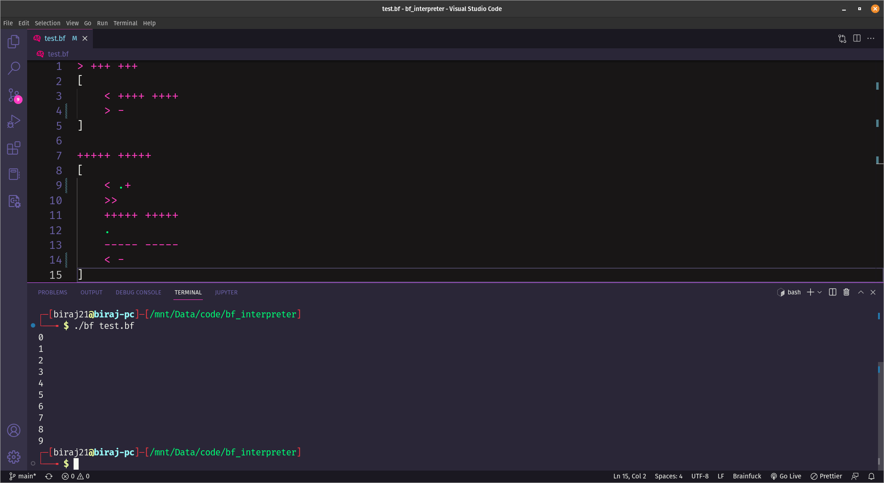

# Biraj's Brainfuck Interpreter

A simple Brainfuck interpreter written in C. It can also transpile a Brainfuck program to C.



## Optimizations

It groups adjacent characters of the same type into a single instruction. These optimized instructions are then ran by the interpreter.

### Example:

Source:

```
++++ ++++
```

Optimized code:

```
{ '+' : 8 }
```

Before this optimization, it used to take roughly 41 seconds to run [Erik Dubbelboer](https://github.com/erikdubbelboer)'s [Mandelbrot program](https://github.com/erikdubbelboer/brainfuck-jit/blob/master/mandelbrot.bf). After optimization, it takes about 17 seconds.

## Build:

```
make
```

## Usage:

```
bf [--traspile] [FILE]
```

## Examples:

Interpret:

```
bf test.bf
```

Transpile to C:

```
bf --transpile test.bf
```
